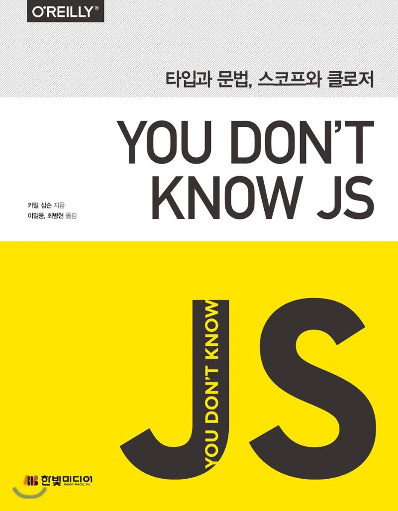

# 자바스크립트는 계속 공부해야하는 언어

## You Don't Know JS 란?

- 자바스크립트는 언어 전체의 능력 중 일부를 수박 겉핥기 정도만 알고 사용해도 웬만큼 서비스가 가능한 프로그램을 만들어 낼 수 있습니다. (책 원문 참고) 이러한 부분이 자바스크립트의 모순이자 아킬레스건입니다.
  카일 심슨이 작성한 이 서적은 이러한 부분을 꼬집어서 자바스크립트의 전반적인 동작과정, 스코프와 클로저, this와 객체 프로토타입 또는 비동기 등을 깊이 이해할수 있도록 도와줍니다.

- 이 책은 자바스크립트를 학습하는데 있어서 유명한 개발자의 인터넷 블로그나 인프런 유료강의 등에서 배웠던 나의 전반적인 자바스크립트 지식을 한층 더 심화시키고싶은 욕구에 의해서 선택하게되었습니다.
- 서적을 구비하기 전에 여러 클론 프로젝트를 통해 비동기 문법, let / const 사용으로 인한 함수스코프와 블록스코프의 차이점, 클로저, 이터레이터/이터러블 프로토콜과 제네레이터, V8 엔진의 간단한 동작과정 등 ( 당장 기억나는 만큼 써보았음..)을 "알고"는 있었으나 정확하게 ( 내가 남들 앞에서 헤메지 않고 설명할 만큼) 이해하고 유연하게 사용하고 있지 않다고 스스로 비판하고 있었습니다. 이 책을 읽고 이해하고 소스코드를 실행해보면서 내 자바스크립트 지식이 좀더 전문화 되었으면 하고있습니다. - 2020.10.20 -

- 후기가 감명깊었던 블로그 링크하나를 첨부합니다. https://sustainable-dev.tistory.com/5

- 코드 환경은 node.js 환경에서 vscode 로부터 작성됩니다.

## Core JavaScript

- 나의 두번 째 자바스크립트 책
- 같은 내용이 나올지라도 꾸준히 읽어야 는다. - 내피셜
